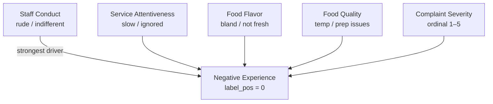

# Factors Explaining Negative Yelp Experiences

**Dataset:** 250 reviews (125 negative `label_pos=0`, 125 positive `label_pos=1`)  
**Augmented columns:** `service_staff_behavior`, `service_attentiveness`, `food_quality_issue`, `food_flavor_issue`, `complaint_severity`

---

## Causal Graph Summary

---

## Factor 1 — Staff Conduct (strongest signal)

| Behavior | Negative reviews | Positive reviews |
|---|---|---|
| `indifferent_or_unprofessional` | 48 (38%) | 4 (3%) |
| `rude_or_dismissive` | 31 (25%) | 2 (2%) |
| `positive_or_friendly` | 9 (7%) | 62 (50%) |

Staff being **rude or dismissive** is the single most concentrated predictor: 63 of 125 negative reviews (50%) cite unprofessional or openly rude conduct, compared to just 6 of 125 positive reviews. Rude behavior also carries the **highest mean severity score** among negative reviews (4.0/5), vs. 2.9 for cases where staff behavior is absent or positive.

---

## Factor 2 — Service Attentiveness (strong secondary driver)

| Attentiveness | Negative | Positive |
|---|---|---|
| `attentive_and_prompt` | 8 (6%) | 63 (50%) |
| `slow_to_respond` | 29 (23%) | 4 (3%) |
| `ignored_or_forgotten` | 9 (7%) | 0 |

Slow or absent service responsiveness appears in 38 of 125 negative reviews. The `ignored_or_forgotten` category is exclusively negative. This factor co-occurs heavily with `indifferent_or_unprofessional` staff behavior (25 joint cases), suggesting **attentiveness is a downstream expression of staff conduct**.

---

## Factor 3 — Food Flavor Issues (moderate driver)

| Flavor | Negative | Positive |
|---|---|---|
| `bland_or_tasteless` | 22 (18%) | 0 |
| `not_fresh_tasting` | 4 (3%) | 0 |
| `positive_flavor` | 4 (3%) | 73 (58%) |

Flavor complaints appear only among negative reviews and are entirely absent from positive ones. However, 93/125 negative reviews (74%) have **no explicit flavor complaint**, meaning food flavor is a secondary rather than primary driver.

---

## Factor 4 — Food Quality Issues (weaker, specific)

Explicit food quality problems (wrong temperature, undercooked, stale, contamination) appear in only 14 of 125 negative reviews (11%). Positive reviews have none. The signal is real but **limited to a minority of negative cases**.

---

## Factor 5 — Complaint Severity Amplifies Outcome

Negative reviews cluster at **severity 3–5** (mean = 3.5), while the 14 positive reviews that carry a severity tag average **2.2**. High severity (4–5) is present in 64 negative reviews (51%), confirming intensity of language as a reliable correlate of the negative label — though severity is a descriptor of the outcome rather than an independent cause.

---

## Exceptions and Weak Evidence

- **35 negative reviews show no staff behavior signal** (`not_present`), suggesting other untagged factors (e.g., billing, environment, wait times) drive some complaints.
- **9 negative reviews** have `positive_or_friendly` staff — food or other issues are the primary driver for this subset.
- Food quality and flavor flags are **sparse overall** (~14% each for quality/flavor in negatives), so food-centric complaints are a secondary, not dominant, causal pathway compared to service.
- The dataset lacks explicit wait-time, cleanliness, and price-value columns in this variant, so those dimensions cannot be quantitatively assessed despite appearing in the GT causal plan.

---

## Decision-Ready Summary

| Factor | Prevalence in Negatives | Causal Confidence |
|---|---|---|
| Staff rudeness / indifference | 50% | **High** |
| Slow / inattentive service | 30% | **High** |
| Bland or stale flavor | 21% | Moderate |
| Food quality defects (temp, prep) | 11% | Moderate |
| Untagged / other factors | ~28% | Low (data gap) |

**Staff conduct and attentiveness are the dominant, best-evidenced explanations for negative Yelp experiences in this dataset.** Food issues matter but explain fewer cases. A roughly 28% residual in negatives with no staff signal points to additional unmeasured factors (likely wait times, pricing, or cleanliness).
