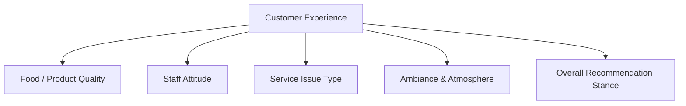

# Yelp Reviewer Experience Aspects — Focus Inference Report

**Dataset:** `yelp_polarity_reviews` | 250 reviews, balanced 125 positive / 125 negative  
**Query:** *What aspects of their experience are Yelp reviewers talking about?*

---

## Concept Tree: Customer Experience Facets

The augmented table surfaces five distinct experience dimensions from `review_text`. Coverage rates and sentiment alignment are summarized below.

---

## 1. Food / Product Quality (57% coverage)

The most frequently discussed aspect overall. The `food_quality_rating` column is populated for 143 of 250 reviews.

| Rating | Negative reviews (label=0) | Positive reviews (label=1) |
|---|---|---|
| excellent | 0 | 48 |
| good | 9 | 30 |
| mediocre | 28 | 2 |
| poor | 25 | 1 |
| not\_present | 63 | 44 |

**Strong sentiment alignment:** Positive reviews almost exclusively pair with *excellent/good* food ratings; negative reviews pair overwhelmingly with *mediocre/poor*. Food quality is the sharpest discriminating aspect between polarities.

---

## 2. Staff Attitude (61% coverage — highest coverage facet)

`staff_attitude` is the most commonly tagged dimension, present in 153 reviews.

| Attitude | Negative | Positive |
|---|---|---|
| warm\_friendly | 11 | 58 |
| rude\_hostile | 72 | 2 |
| neutral\_professional | 5 | 5 |
| not\_present | 37 | 60 |

**Near-perfect polarity split:** *rude_hostile* appears almost exclusively in negative reviews (72/74); *warm_friendly* dominates positive reviews (58/69). Staff behavior is both highly mentioned and highly diagnostic.

---

## 3. Service Issue Type (28% coverage)

Explicit service failures (forgotten orders, slow service, rude dismissal) appear in 71 reviews, nearly all negative.

| Issue | Negative | Positive |
|---|---|---|
| rude\_dismissive | 28 | 0 |
| slow\_inattentive | 21 | 3 |
| ignored\_forgotten | 8 | 0 |
| order\_error | 7 | 2 |
| not\_present | 60 | 119 |

Service issue mentions are concentrated in negative reviews. Positive reviews rarely name a service problem (6/125). *Rude/dismissive* is the single most cited issue type.

---

## 4. Ambiance & Atmosphere (29% coverage)

A secondary, less dominant facet: 72 reviews mention atmosphere at all.

| Mention | Negative | Positive |
|---|---|---|
| positive | 12 | 33 |
| negative | 18 | 2 |
| neutral\_noted | 4 | 3 |
| not\_present | 91 | 87 |

Atmosphere is mentioned more often in positive reviews (positive valence: 33 vs. 12), but a large majority of reviews skip this dimension entirely.

---

## 5. Overall Recommendation Stance

`overall_recommendation_stance` captures the closing intent of reviewers:

| Stance | Count |
|---|---|
| strong\_recommend | 89 |
| would\_not\_return | 70 |
| recommend\_with\_caveats | 50 |
| strongly\_avoid | 36 |
| neutral | 5 |

The distribution shows reviewers lean toward emphatic poles (strong recommend or avoid/not return), with a meaningful middle tier of conditional endorsements (50 reviews). This confirms reviewers frequently frame their experience as advice to others.

---

## Cross-Aspect Patterns

- **30 reviews** mention both food quality issues and a service problem simultaneously — multi-aspect complaints that tend to be the most extreme negative reviews.
- **Positive reviews** most commonly discuss food and staff warmth together; service/facility issues are conspicuously absent.
- **Single-aspect reviews** (only food or only staff mentioned) are common in both polarities, indicating reviewers often focus on the one thing that stood out.

---

## Exceptions & Weak Evidence

- **Atmosphere** is tagged in only 29% of reviews and shows moderate (not absolute) polarity alignment — some negative reviews note neutral or even pleasant surroundings despite a bad experience.
- **44 positive reviews** and **63 negative reviews** have no food quality rating (`not_present`), suggesting a sizable share of reviews covers service businesses (real estate, healthcare, retail) where food is irrelevant.
- `service_issue_type` and `staff_attitude` are partially redundant (rude staff ≈ rude/dismissive service); their co-occurrence should be interpreted cautiously as a single underlying complaint expressed at two granularities.

---

## Summary

Yelp reviewers in this dataset most commonly discuss **staff attitude** (61% mention rate) and **food/product quality** (57%), making these the two dominant experience facets. **Service failures** (slow service, being ignored, rude dismissal) form a distinct but narrower third pillar, appearing in 28% of reviews and almost exclusively in negative ones. **Atmosphere** is a secondary, optional facet mentioned by about a third of reviewers. Across all aspects, polarity alignment is strong — the facet values reliably track whether a review is positive or negative, with food quality and staff attitude serving as the clearest discriminators.
